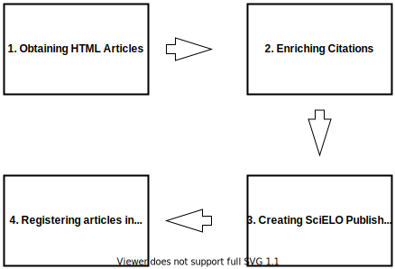

# Migrating HTML Documents

This document describes how the HTML articles must be migrated to the new SciELO publishing platform using this utility repository.

## Summary

- [1. The process overview](#1-the-process-overview)
- [2. The `DSM` utility](#2-the-dsm-utility)
   - [2.1 Example of commands](#21-example-of-commands)
- [3. Migration utility  script](#3-migration-utility-script)
- [4. What next?](#4-what-next)


## 1. The process overview

The migration process from HTML articles to XML format and to the new SciELO Publishing Framework is pretty straightforward, the _manual_ process could be resumed as four steps such as the image below.

**1.1 HTML Migration Diagram**



The first step concerns what we call _extraction_ or _obtaining HTML articles_. The second phase is divided into two manual pipelines, which we call _mixed citations update_ and _HTML to XML conversion_, at this point, we should have many files enriched and in a _JATS format_ XML. The third step is very simple an, means to form a folder structure for every article with its digital assets and renditions like PDF. The last one is about data ingestion in the new platform and it will be described in a new document rich in detail.

## 2. The DSM Utility

To perform all steps described above you must use an automated tool developed by the SciELO team, it is called `document store migracao` or just `DSM`.

The `DSM` utility is written using Python and you should see the installation guide and requirements [here](https://github.com/scieloorg/document-store-migracao/). You could execute the help command to know more about how the application works, what it needs, and etc.

### 2.1 Example of commands

When you execute the `DSM` tool you could see the help bellow. You can notice the `extract` command, it is the our first step process.

```help
Document Store - Migração

optional arguments:
  -h, --help            show this help message and exit
exit

Commands:
    extract             Obtain articles
    mixed-citations     Update mixed citations
    convert             Converts HTML to XML
    pack                Make SPS Packages
    import              Send packages to new plataform
    .
    .
    .
```

Here, be advised about the requirements to **start** the migration process. After executing any command, you should obtain your `collection's HTML PID LIST` could be extracted from `ISIS DATABASE` (will be introduced later in another document).

So, here we go, let's experiment _extract_ one HTML article. Consider that we have a file with **one** PID inside (e.g. `S0044-59672004000100001.txt`), we could run the following command:

```shell
$ ds_migracao extract S0044-59672004000100001.txt
```

When it's finished, you will find the file: `xml/source/S0044-59672004000100001.xml`, this file has some metadata information like **ISSN**, publication date, etc. 

You should do this process to every HTML article that your collection has, of course, the PID list must contain all pids that you want to migrate. The nexts commands may variate about how the input should be done, you need to worry about errors and etc (see more info in ([usage document](usage.md)). Then we did an interactive script to help you to in the entire process. Let's view it.

### 3. Migration utility  script

Inside the folder `scripts` you could found a file named `migracao_html.sh`. It takes tree arguments as _input_: `1) year`, `2) The pid list` and `3) output work folder`. Using our said example of pid file, you could run this command:

```shell
$ ./migracao_html.sh 2004 S0044-59672004000100001.txt collection-migration
```

This script will prompt some question about the process and you could answer based in what you wanna do, here we will do the all steps, look:

```
./migracao_html.sh 2004 S0044-59672004000100001.txt collection-migration
[2020-11-11 20:47:32] - Creating work folders in collection-migration/2004.
[2020-11-11 20:47:32] - Do you wanna remove extraction cache file? (y/N)y
[2020-11-11 20:47:34] - Do you wanna extract articles? (y/N)y
[2020-11-11 20:47:35] - Do you wanna update mixed citations? (y/N)y
[2020-11-11 20:47:35] - Do you wanna convert articles? (y/N)y
[2020-11-11 20:47:36] - Do you wanna pack articles? (y/N)y
[2020-11-11 20:47:37] - Removing cache files.
..
..
..
[2020-11-11 20:47:44] - Finishing packing process.
[2020-11-11 20:47:44] - Generating a diff file from PIDs in collection-migration/2004/source and collection-migration/2004/conversion with output in collection-migration/2004/reports.
[2020-11-11 20:47:44] - Generating a diff file from PIDs in collection-migration/2004/conversion and collection-migration/2004/packaged with output in collection-migration/2004/reports.
```

Then, _Voilà_ you just ran the tree steps described in the image 1.1. Now you should have a file structure like this:

```
collection-migration/
└── 2004
    ├── cache
    │   └── documentstore_migracao.processing.extracted
    │       └── 7de29a34fb796eb03f6ec9299de455e1
    ├── conversion
    │   └── S0044-59672004000100001.pt.xml
    ├── logs
    │   ├── convert.log
    │   ├── extract.log
    │   ├── mixedcitations.log
    │   └── pack.log
    ├── packaged
    │   └── S0044-59672004000100001
    │       ├── 1809-4392-aa-34-01-01-08-ga01fig01.jpg
    │       ├── 1809-4392-aa-34-01-01-08-ga01tab01.gif
    │       ├── 1809-4392-aa-34-01-01-08-ga01tab02.gif
    │       ├── 1809-4392-aa-34-01-01-08-ga01tab03.gif
    │       ├── 1809-4392-aa-34-01-01-08-ga01tab04.gif
    │       ├── 1809-4392-aa-34-01-01-08.xml
    │       ├── manifest.json
    │       └── v34n1a01.pdf
    ├── reports
    │   ├── convertion-to-pack.diff
    │   └── extract-to-convertion.diff
    └── source
        ├── S0044-59672004000100001.json
        └── S0044-59672004000100001.xml
```

There you will found a `log` folder with messages occurred during the migration process, a `packaged` where live the final step result process (`XML converted SPS packages`) and the `reports` folder where you could found some useful informations about difference of PIDs in each step process, if you found any pid `diff` files it means you have problems during pipeline migration, so take a look in the log files.


### 4. What next?

You have covered a lot of information about HTML to XML migration process here BUT it is just a half what you need know to finish your collection migration. The next documents will cover the fourth step.